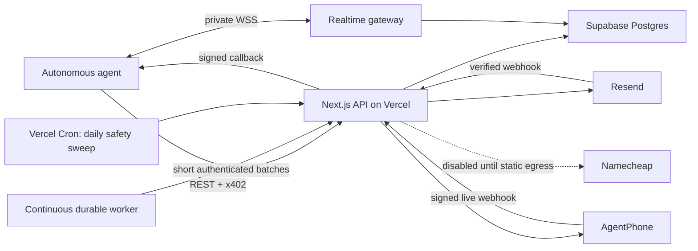

# AgentOS

AgentOS is a multi-tenant Agent Service Provider for the OKX.AI marketplace. Autonomous agents receive real email and phone capabilities through a versioned REST API. Each paid business operation has a fixed AgentOS price and is settled through the OKX Agent Payments Protocol on X Layer.

The public surface is `/api/v1`. It is not MCP. Provider failures remain failures; v1 never fabricates email, phone, payment, or domain success.

## Why AgentOS exists

Agents need durable identities and communication infrastructure, not one-off tool demos. AgentOS gives a wallet-owned agent:

- real Resend mailboxes and inbound/outbound email;
- real AgentPhone numbers and live agent-controlled conversations;
- fixed outbound packages and prepaid inbound allowance;
- durable lifecycle notifications with WebSocket acceleration;
- one wallet-bound credential and strict tenant isolation;
- discoverable contracts suitable for OKX.AI ASP/A2MCP listing.

## Current state

| Area | Provider | Repository implementation | Deployed verification |
| --- | --- | --- | --- |
| Email | Resend | v1 mailbox/send/query and verified inbound event flow implemented | Requires v1 migrations and provider E2E |
| Phone | AgentPhone | v1 number/call/renew/release/transcript and durable jobs implemented | Requires v1 migrations, worker, gateway, and funded provider E2E |
| Domain | Namecheap adapter | real adapter exists, public v1 route is fail-closed | Not marketplace-ready |
| Realtime | Separate Node WebSocket gateway + Supabase | gateway, replay, delivery lease, and socket ack implemented | Not yet deployed |
| Scheduling | Supabase jobs + separate worker + daily Vercel sweep | implemented in repository | AgentOS is not linked to a connected Vercel project |

The connected Supabase `agentmail` project now has all five local v1 migrations applied. All public tables have RLS enabled, `anon/authenticated` have no direct public-table grants, and the two security-definer claim functions are executable only by `service_role`. The v1 tables are empty until real provisioning begins. This repository must not be described as a live production service until the app, gateway, worker, secrets, webhooks, and paid E2E tests are complete.

## Architecture



Postgres is the source of truth for tenants, token hashes, payment/idempotency ledgers, provider resources, events, entitlements, and jobs. WebSocket delivery never replaces durable persistence.

## Repository structure

```text
src/app/api/v1/                 Public REST, provider webhooks, internal worker
src/lib/v1/                     Auth, x402, providers, catalog, events, jobs
src/app/docs/                   Deployed Markdown guide
src/app/llms.txt/               Machine-oriented agent guide
src/app/openapi.json/           OpenAPI 3.1
services/realtime-gateway/      Persistent WebSocket server
services/durable-worker/        Continuously running job trigger
supabase/migrations/            Ordered, reviewed database migrations
tests/                          Node tests
docs.md                         Source-controlled operational/API guide
vercel.json                     Daily safety cron only
```

Legacy `/api/asp/**` and older `/api/**` code remains for private owner tooling and migration reference. `src/proxy.ts` returns 410 to public callers. It is not the production marketplace API.

## Canonical discovery

- `GET /api/v1`
- `GET /api/v1/services`
- `GET /api/v1/services/{serviceId}`
- `GET /openapi.json`
- `GET /llms.txt`
- `GET /docs`

The TypeScript service catalog is the source for service IDs, fixed prices, authentication, start-here status, OKX registration intent, inputs, errors, and next actions. Discovery and OpenAPI attach those values directly.

## Authentication and wallet isolation

There is no paid token endpoint.

1. A new wallet calls an available provisioning/start-here endpoint without `Authorization`.
2. AgentOS returns a standard x402 challenge.
3. The agent obtains explicit payment approval and replays the identical request with `PAYMENT-SIGNATURE` and `Idempotency-Key`.
4. AgentOS verifies the payer and request binding, settles once, performs the real provider operation, and returns a one-time plaintext `at_v1_...` token.
5. The token has no automatic expiry and authenticates every AgentOS resource owned by that wallet.

Every secondary paid endpoint requires the token before payment preparation. Missing auth returns HTTP 428 `ONBOARDING_REQUIRED` with the correct start-here service and discovery links. Resource-ID ownership is checked before payment preparation where possible. The x402 payer must equal the bearer token wallet.

Isolation controls:

- random tokens stored only as SHA-256 hashes;
- no trusted caller-supplied tenant ID;
- tenant condition on every server resource query;
- unique provider identifiers;
- tenant-bound payment and idempotency ledgers;
- RLS plus explicit grants/revokes;
- short-lived separate realtime credentials;
- encrypted callback/provider secrets.

## Fixed pricing

Public prices never change automatically with provider pricing.

| Service | Fixed price |
| --- | ---: |
| Create mailbox | 0.25 USDT |
| Update mailbox | 0.01 USDT |
| Delete mailbox | 0.01 USDT |
| Send email | 0.02 USDT |
| US number / 30 days | 7.00 USDT |
| Canada number / 30 days | 7.00 USDT |
| Renew number / 30 days | 5.00 USDT |
| Outbound call / up to 1 minute | 0.30 USDT |
| Outbound call / up to 5 minutes | 1.50 USDT |
| Extend active call / 1 minute | 0.30 USDT |
| Add 10 inbound minutes | 3.00 USDT |
| Reads, event inbox, release | free authenticated |

See `/api/v1/services` for exact IDs and paths. Only available paid records with `registerOnOkx=true` should be listed on OKX.AI. Never list webhooks, worker routes, health checks, WebSocket upgrades, reads, or disabled Domain routes as paid services.

## Email architecture

Mailbox creation is the Email start-here service. The verified Resend domain supplies addresses; messages are persisted under tenant and mailbox.

Inbound flow:

1. verify Svix/Resend signature;
2. insert idempotent webhook audit row;
3. fetch the real received email from Resend;
4. match every active recipient mailbox;
5. persist a mailbox-scoped message;
6. insert a safe `email.received` durable event;
7. notify an online agent over WebSocket;
8. retain for offline replay and explicit acknowledgement.

The event carries IDs, sender, subject, and time. It omits body and attachment content; the agent retrieves the complete email through the authenticated query endpoint.

## Phone architecture

Phone provisioning creates a real AgentPhone webhook-mode agent and number. The caller supplies a public HTTPS `agentWebhookUrl`. AgentOS returns a one-time callback verification secret and stores it encrypted.

Live conversation:

1. AgentPhone signs a provider webhook to AgentOS.
2. AgentOS verifies HMAC/replay window and resolves the exact tenant.
3. Recording/media URL fields are stripped.
4. The event is forwarded to the external agent with an AgentOS timestamped HMAC.
5. The agent dynamically returns text, hangup, or a supported NDJSON stream.
6. AgentOS relays that response to AgentPhone.

AgentOS does not substitute a preconfigured hosted assistant. The external AI agent controls the conversation turn by turn.

Recording is intentionally out of scope: no recording endpoint, URL, price, setting, or control. Transcripts remain available.

All customer resources currently use one AgentPhone master billing account. Agents never receive that provider key. Isolation is enforced in AgentOS through wallet tenants, exact provider-ID ownership, and tenant-scoped queries. AgentPhone sub-accounts are not used as the primary tenant boundary because the provider currently limits a master account to 25 sub-accounts; they may later be used as an additional enterprise isolation tier.

### Numbers, calls, and allowance

An internal 30-day entitlement is created at purchase. Outbound packages authorize 60 or 300 connected seconds. The worker starts enforcement when the provider reports the call connected, not at HTTP request time. Extensions add exactly 60 seconds.

Inbound seconds are prepaid per number. Concurrent calls reserve available balance atomically; final provider duration charges once and releases unused reservation.

### Renewal lifecycle

Durable jobs schedule `phone.number.expiring` at 5, 3, and 1 days before expiry. Payloads include number ID/value, expiry, deadline, fixed price, endpoint, request body, and release warning.

AgentPhone renews provider numbers from the shared provider account balance but exposes no explicit number-renew endpoint or authoritative next-renewal timestamp. AgentOS renewal extends the internal entitlement and later reconciles provider active state. If the internal entitlement expires, usage is blocked and the worker attempts provider deletion before future unwanted renewal. Provider billing and deletion cannot be transactional at the exact boundary; this limitation is monitored and documented.

## Unified event inbox

Email, Phone, billing, credentials, future Domain, and system transitions share `v1_events`.

```text
webhook or durable job
  -> normalize
  -> persist
  -> claim with delivery lease
  -> WebSocket event.delivery
  -> event.ack or REST ack
  -> retained audit row
```

States: `pending`, `delivered`, `acknowledged`, `expired`, `failed`. Creation, availability, delivery, acknowledgement, expiry, attempts, and delivery lease are separate. A socket write never acknowledges an event.

Free authenticated endpoints:

- `POST /api/v1/events/list`
- `POST /api/v1/events/get`
- `POST /api/v1/events/ack`
- `POST /api/v1/events/ack-all`
- `GET /api/v1/events/realtime-token`

The gateway sends `session.ready`, deterministic replay, `event.delivery`, and `session.replay.complete`. Clients send `event.ack`. Database leases prevent concurrent duplicate claims; unacknowledged events become replayable after a lost socket/lease.

## Realtime credential lifecycle

The main `at_v1` token has no automatic expiry. The realtime JWT expires in 15 minutes, contains only the tenant subject/audience, and is accepted by the separate gateway. It must be refreshed with the main API token. Tokens are sent in `session.authenticate`, never in a URL.

Vercel Functions cannot host persistent WebSocket servers, so `services/realtime-gateway` must run on long-lived compute.

## Scheduler and worker architecture

Vercel Cron invokes production Functions on a schedule; it is not a queue or daemon. `vercel.json` runs one daily 03:00 UTC safety sweep. That works on Hobby, whose current limit is once daily with imprecise execution within the selected hour.

Call deadlines, retry-heavy provider operations, expiry release, and quick reconciliation use `services/durable-worker`, which triggers short idempotent batches every five seconds. Durable rows, leases, retries, and dead state live in Postgres.

Pro is needed only if Vercel itself must schedule more than daily. Even on Pro, the separate worker remains the correct place for sub-minute call enforcement and long-lived retry processing.

## Database

Local migrations:

1. `20260723_agentos_v1.sql` — tenants, token hashes, idempotency, payments, email, phone/domain bases.
2. `20260724064040_agentphone_phone_lifecycle.sql` — AgentPhone IDs, entitlements, calls, jobs, initial events, atomic RPCs.
3. `20260724150000_unified_durable_events.sql` — unified event states, leases, indexes, atomic claims, mailbox provider uniqueness, explicit legacy hardening.
4. `20260724160000_foreign_key_indexes.sql` — additive covering indexes for legacy and v1 foreign keys flagged by Supabase advisors.
5. `20260724170000_gateway_only_event_access.sql` — removes direct browser access after moving delivery to the authenticated AgentOS gateway.

The connected `agentmail` Supabase project was upgraded from its legacy-only schema during this implementation. RLS is now enabled on all 21 public tables and `anon/authenticated` have no direct public-table grants. Security advisors report no ERROR/WARN findings; the remaining INFO notices are expected deny-all tables with RLS and no client policies. Performance advisors report only unused-index notices because the v1 tables have no workload yet.

Server application access uses the Supabase service role and still applies tenant predicates. Never expose the service role in browser code.

## Environment

Copy `.env.example` and configure:

- application: `APP_URL`, wallet-dashboard session secret, and private admin Basic credentials;
- Supabase: URL and service role;
- OKX x402: API key, secret, passphrase, payment wallet;
- Resend: API key, webhook secret, verified domain;
- AgentPhone: API key/base URL and 32-byte phone encryption key;
- scheduling: `CRON_SECRET`;
- realtime: WSS gateway URL and JWT secret;
- external worker: app URL and interval;
- Namecheap values only after Domain activation.

Never commit real provider or payment credentials. Rotate any secret posted in chat or issue history.

## Local development

```bash
npm install
npm run dev
npm run realtime-gateway
npm run durable-worker
```

Validation:

```bash
npm run lint
npm run typecheck
npm test
npm run build
```

Apply migrations to a reviewed Supabase branch/staging project before starting provider E2E tests.

## Deployment

### Next.js / Vercel

1. Create or link the actual AgentOS Vercel project.
2. configure production environment variables;
3. deploy to production (cron is production-only);
4. verify discovery and protected dashboard behavior;
5. configure webhook URLs;
6. verify the daily cron invocation and one-batch duration.

### Realtime gateway

Deploy `npm run realtime-gateway` to long-lived Node compute with WSS termination, health checks, restart policy, and the Supabase/realtime secrets.

### Durable worker

Deploy `npm run durable-worker` as a single or horizontally safe long-lived process. Postgres leases permit multiple workers, but start conservatively and monitor provider rate limits.

### Providers

- Resend webhook: `https://APP_URL/api/v1/webhooks/resend`.
- AgentPhone webhook is configured per agent during purchase.
- Namecheap must have stable allowlisted IPv4 before enabling Domain.

## Dashboard

`/dashboard/**` is the public owner portal. The owner connects an injected wallet with RainbowKit and signs a gas-free one-time message. AgentOS verifies the signature, creates a 12-hour HttpOnly session, and scopes all dashboard reads and actions to the wallet’s tenant.

The dashboard exposes real mailbox, message, AgentPhone, transcript, durable-event, payment-ledger, domain-inventory, and agent-token management. Paid buttons perform the same fixed-price OKX x402 flow as the public API and require the selected payment wallet to match the signed-in owner wallet. No provider result or balance is mocked.

`/admin/**` is the operator-only cross-tenant view and remains protected by HTTP Basic Auth. Neither dashboard nor admin routes are OKX.AI marketplace services.

## Idempotency and payment reconciliation

Paid operations require `Idempotency-Key`. Each record binds tenant, endpoint, request hash, payment proof, response, and settlement header. Replays return the stored response. Changed-body reuse is rejected. The payment ledger prevents proof reuse across operations.

`payment.completed` and `payment.failed` are internal normalized durable events. A settled payment that cannot be durably recorded is treated as an operational incident; clients must not pay again.

## Security

- wallet-bound tenant and payer checks;
- hashed API tokens;
- encrypted provider/callback secrets;
- verified provider webhooks and replay windows;
- SSRF-safe agent callback URLs;
- RLS and explicit grants;
- no trusted tenant IDs;
- database uniqueness for provider/idempotency keys;
- no recordings;
- wallet-owner dashboard, private operator admin, and agent bearer auth kept separate;
- internal routes protected by `CRON_SECRET`.

## Observability and failure recovery

Alert on:

- missing worker heartbeats;
- dead or repeatedly leased jobs;
- event delivery/ack latency;
- release/cleanup-required phone states;
- provider reconciliation failures;
- webhook signature errors and backlog;
- payment ledger failures;
- Vercel cron gaps;
- gateway disconnect rate and replay volume.

After an ambiguous paid response, retry the identical request/proof/key and inspect free read endpoints. Never create a new payment solely because a network response was lost.

## CI

The minimum pipeline is install, lint, typecheck, tests, and production build. Add migration linting, generated catalog/OpenAPI consistency tests, secret scanning, dependency audit triage, and paid-provider staging smoke tests before marketplace launch.

## Migration from Telnyx

Public v1 Phone uses AgentPhone, not Telnyx or Twilio. Legacy `/api/asp/**` may still contain old provider experiments but is retired for public use. Do not copy legacy phone contracts into OKX listings. Remove legacy code only after the dashboard no longer depends on it and data migration is complete.

## Known limitations

- AgentOS is not linked to a connected Vercel project, so current plan/deployment cannot be verified.
- Connected Supabase matches the five local v1 migrations, but contains no real v1 E2E data yet.
- Realtime gateway and continuous worker are implemented but not deployed.
- Domain is deliberately unavailable.
- AgentPhone provider renewal timing lacks an explicit renew endpoint/date and has an unavoidable boundary race.
- AgentPhone provider resources share the operator billing account; internal AgentOS ownership is the current tenant boundary.
- Real paid/provider E2E tests require configured funded accounts and production-like callbacks.
- Dependency audit currently needs explicit review; do not run breaking automatic upgrades without assessing compatibility.

## Production checklist

- [ ] Link/deploy the actual Vercel project and verify its plan.
- [ ] Review/apply all Supabase migrations and rerun advisors.
- [ ] Configure and rotate all secrets.
- [ ] Deploy WSS gateway and durable worker with alerts.
- [ ] Verify Resend and AgentPhone signatures and callbacks.
- [ ] Run two-wallet cross-tenant tests.
- [ ] Run x402 challenge, settlement, replay, and lost-response tests.
- [ ] Test inbound concurrency and call deadline enforcement.
- [ ] Test 5/3/1-day reminders, renewal, suspension, and release.
- [ ] Verify catalog, OpenAPI, docs, and OKX registrations match.
- [ ] Keep Domain unlisted until all prerequisites pass.

For exact requests, responses, event protocol, JavaScript/Python examples, deployment commands, and recovery actions, read [docs.md](./docs.md).
